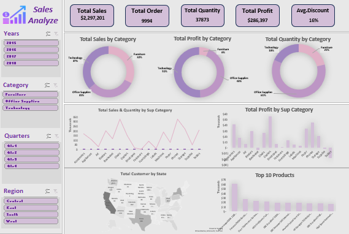

# Sales Performance Dashboard

## Dashboard Preview

## Project Overview
This project features an interactive Sales Dashboard built in Excel to analyze business performance. The goal is to transform raw sales data into actionable insights, helping stakeholders track trends and key metrics efficiently.

## Key Features
* **Pivot Tables & Charts**: Used to summarize large datasets and visualize sales trends.
* **Dynamic Slicers**: Interactive filters for Years, Categories, Quarters, and Regions.
* **Professional Layout**: Organized view showing Total Sales ($2,297,201) and Total Profit ($286,397).

## How to View
1. Download the `Sales_Analysis.xlsx` file from this repository.
2. Open it in Microsoft Excel to interact with the Slicers.
